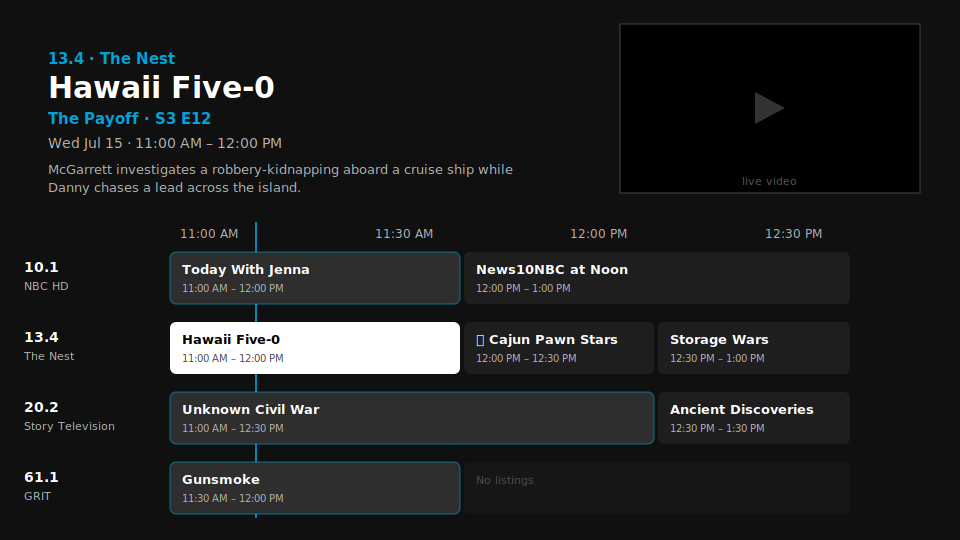

<p align="center">
  
</p>

<p align="center">
  <a href="https://github.com/TheGav179/homelabtv/actions/workflows/ci.yml"></a>
  <a href="https://github.com/TheGav179/homelabtv/releases"></a>
  <a href="LICENSE"></a>
</p>

An open-source live TV app for Android TV that uses your TV's **built-in tuner** for video and your **homelab server** for guide data — and keeps working when the server is down.

Think of it as a replacement for the manufacturer's TV app (Sony's, in particular), with a Jellyfin-style UI, a real timeline guide, and none of the telemetry.

<p align="center">
  
</p>
<p align="center"><sub>Illustration of the guide — the TV's protected video path blocks direct screen captures, so real screenshots are welcome contributions.</sub></p>

## Why it's different

Most self-hosted live TV setups (Plex, Jellyfin, Emby, Channels DVR, Tvheadend) put the **server in the video path**: a network tuner feeds the server, the server streams to the app, and if the server is down there's no TV.

HomelabTV splits the jobs:

```
┌─────────────────────────┐          ┌──────────────────────────────┐
│       Android TV        │          │   Homelab server (Docker)    │
│                         │   HTTP   │                              │
│  Antenna → TV tuner ────┼────╳─────┤  XMLTV files (WebGrab+Plus,  │
│  (video never leaves    │   guide  │  zap2xml, ...)               │
│   the TV)               │   data   │  + TMDB artwork cache        │
│                         │   only   │  + channel mapping web UI    │
└─────────────────────────┘          └──────────────────────────────┘
```

- **Video** comes from the TV's own ATSC tuner via Android's TV Input Framework. The server is never in the video path.
- **Guide data** (schedules, posters, backdrops, logos) comes from the server and is cached on the TV. Server offline? Everything keeps working — the guide just shows how old its data is.

## Built for WAN-blocked TVs

This app assumes a mindset where the smart TV **never touches the internet**. A common way to get there: give the TV a static IP with a bogus (or empty) gateway, or block its MAC at the router — it can still reach everything on your LAN, but nothing beyond it. Telemetry, ads, and forced updates die at the router.

> **⚠️ Mind IPv6.** The bogus-gateway trick only blocks IPv4 — if your LAN has IPv6, the TV auto-configures a working route straight past it and stays fully online. Verify from the TV (`adb shell ping6 google.com`); if it answers, disable IPv6 (or router advertisements) on the LAN, or block the TV's **MAC** at the router — per-address IPv6 blocking is whack-a-mole because devices rotate privacy addresses.

HomelabTV is proof that the TV doesn't need WAN for any of this: live video comes off the antenna, and everything that *does* need the internet — XMLTV scraping, TMDB artwork — happens **server-side**. The TV only ever talks to your server over plain HTTP on your LAN, and thanks to the offline-first cache it doesn't even need *that* to keep working.

## Features

- Jellyfin-style dark UI with backdrop art from TMDB
- Full-screen timeline guide (EPG) with a live mini-player, "now" line, and time-anchored D-pad navigation (long program blocks don't fling your cursor sideways)
- Guide opens on the channel you're watching
- Channel zapper bar with progress and "next up"
- Direct channel number entry from the remote's number pad
- Detailed info banner (Info / Options tabs) with audio track and closed-caption selection
- Offline-first: last guide sync is cached on the TV as JSON
- All artwork (TMDB posters/backdrops, remote channel logos) is cached and served by the server, so the TV loads images over the LAN and never needs internet access
- Resumes on the channel you were last watching
- Channel rescan integration: launch the tuner's scan wizard from Settings; the channel list reloads automatically when you return
- Server web UI for mapping physical channels to XMLTV IDs, uploading channel logos, and overriding names/posters

## Requirements

- **TV**: Android TV with a built-in tuner exposed through the TV Input Framework (tested on Sony Bravia with ATSC; other brands with hardware tuners should work — reports welcome). Streaming boxes without tuners will only show the guide.
- **Server**: anything that runs Docker.
- **Guide source**: one or more XMLTV files (WebGrab+Plus, [zap2xml](https://github.com/jef/zap2xml), or any XMLTV producer). Every `.xml` file in the data directory is parsed.
- Optional: a free [TMDB API key](https://www.themoviedb.org/settings/api) for posters and backdrops.

## Setup

### 1. Backend

```bash
cd backend
# put your XMLTV files in ./data (or edit docker-compose.yml to mount your existing directory)
TMDB_API_KEY=yourkey docker compose up -d
```

Open `http://<server>:30060` and map each XMLTV channel to its physical channel number (e.g. `7.1`). You can also upload channel logos and delete/override mappings there.

Example zap2xml companion container (6-hour refresh, 3 days of data):

```yaml
services:
  zap2xml:
    image: ghcr.io/jef/zap2xml:latest
    environment:
      - POSTAL_CODE=YOUR_ZIP
      - COUNTRY=USA
      - LINEUP_ID=USA-OTA-YOUR_ZIP
      - OUTPUT_FILE=/data/xmltv.xml
      - TIMESPAN=72
      - SLEEP_TIME=21600
    volumes:
      - ./data:/data
    restart: unless-stopped
```

> **Tip:** if a guide scraper starts getting IP-blocked, route just that container through a VPN with [gluetun](https://github.com/qmcgaw/gluetun) (`network_mode: "service:gluetun"` on the scraper). The HomelabTV backend itself has no reason to go through it — only the scrapers talk to the outside world.

### 2. App

**Option A — prebuilt APK**: download the latest `homelabtv-*.apk` from [Releases](https://github.com/TheGav179/homelabtv/releases) and sideload it:

```bash
adb connect <tv-ip>:5555
adb install -r homelabtv-*.apk
```

(Or use any sideloading method you like — "Downloader"-style apps on the TV work too.)

**Option B — build it yourself**:

```bash
cd android-app
./gradlew assembleDebug
adb connect <tv-ip>:5555
adb install -r app/build/outputs/apk/debug/app-debug.apk
```

On first launch the app asks for the `READ_TV_LISTINGS` permission (required to see the TV's scanned channels), then set your server URL in **Menu (Back button) → Settings**.

## Remote controls

| Key | Action |
|---|---|
| D-pad Up/Down, CH +/- | Change channel |
| Last-channel key, D-pad Left | Jump back to the previously watched channel |
| Number keys | Direct channel entry (`0` `6` → `06.x`, `6` `1` → `61.x`; see Caveats) |
| OK | Toggle channel info bar |
| OK (long press) | Detailed banner: show/episode info, audio + subtitle tracks |
| OK (long press, in guide) | Set/remove a reminder on a future program |
| GUIDE | Open/close the timeline guide (opens on the current channel) |
| INFO | Info bar with clock; quick second press → detailed banner |
| BACK | Close current overlay / open the side menu |

When a reminded program starts, a banner appears: OK tunes to it, BACK dismisses.

## Caveats

- Channel-number entry uses ATSC-style `major.minor` numbering with three modes (**Settings → Number Entry**). **Auto** (default) learns from your scanned lineup: a typed prefix completes the instant no other channel number could extend it — with majors 6, 10, 13 and 20, typing `6` jumps straight to the subchannel, `1` waits for a second digit, and if a 61.1 exists in your lineup, `6` waits too. The same logic applies to subchannels (with minors 1, 2 and 12, typing `.2` commits instantly but `.1` waits). **Leading Zero** always takes two-digit majors (`06` for channel 6). **Quick** completes any first digit above a configurable threshold (Settings shows the threshold item while Quick is active). In every mode, pausing for 2 seconds commits whatever you've typed.
- Manufacturer firmware quirks vary. Example: Sony shows its own system InfoBar on the ⓘ key at firmware level, which no app can suppress — that's why everything is also reachable via OK.
- The first guide request after new XMLTV data lands is slow while new titles are enriched against TMDB (cached for 7 days afterward); the app tolerates this with generous timeouts.

## License

[MIT](LICENSE)
